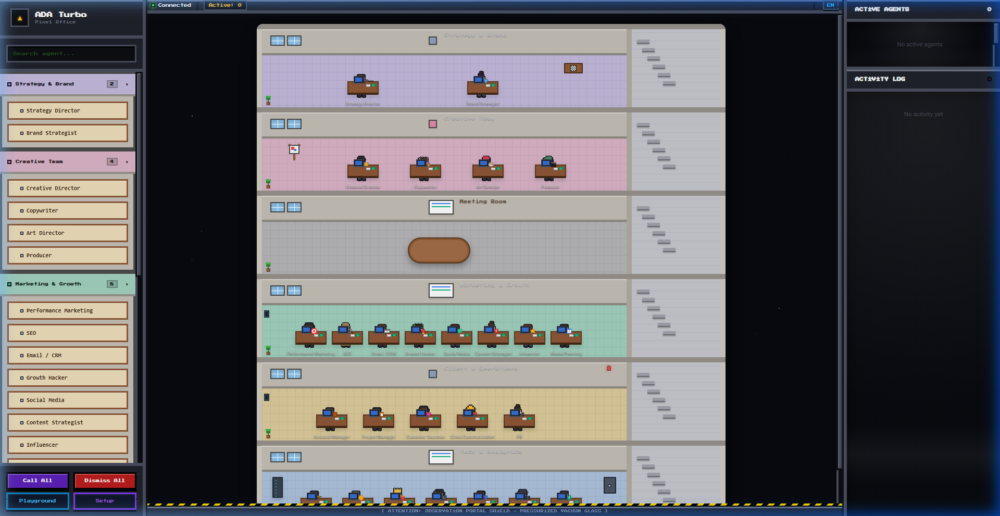
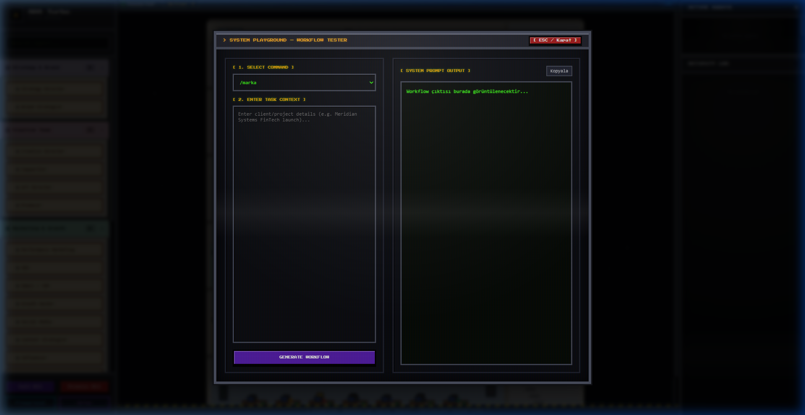
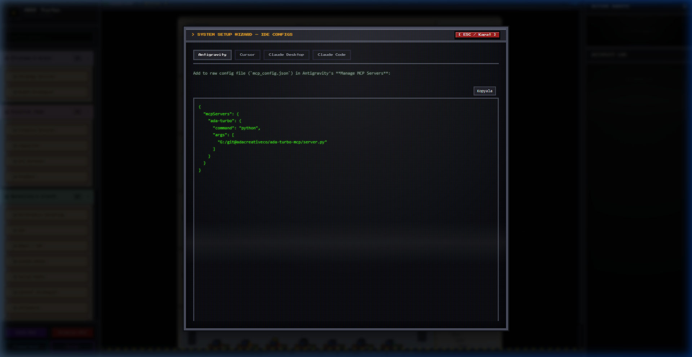

# ADA Turbo — Agency OS & Pixel Office

🇺🇸 English Documentation | 🇹🇷 [Türkçe Dokümantasyon](README.tr.md)

ADA Turbo is a commercial-grade infrastructure that delivers the ADA Creative Co. agency operating system via **MCP (Model Context Protocol)** and an interactive **Pixel Office Visualizer**.
The complete agency structure comprising 26 roles — strategy, creative, marketing, client relations, analytics, product, and technical — is instantly available in any MCP-compatible client and as a real-time local web workspace with direct LLM integration.

---

## 🚀 Key Features

- **Unified Dual-Mode Architecture:**
  - **MCP Mode (Default):** Runs as an MCP stdio server. Concurrently starts the Pixel Office Web Server in the background. Provides seamless integration with Antigravity, Claude Code, Cursor, Claude Desktop, and Windsurf.
  - **Pixel Office Web Mode:** Starts a local, highly-optimized retro CRT-effect web interface (default port `8000` with automatic conflict fallback to `8001`, `8002`...).
- **⚡ Real-Time Server-Sent Events (SSE):**
  - Instant zero-latency agent event streaming (`/api/events`). When an agent is triggered in your IDE, the character visually walks to their desk in real-time.
- **🧠 Direct Live LLM Engine:**
  - Multi-provider AI execution directly in the browser via `/api/llm-generate`:
    - 🟢 **Built-in Template Engine (Offline):** Instant access to professional agency workflow templates.
    - ✨ **Google Gemini:** `gemini-2.0-flash`, `gemini-1.5-flash`, `gemini-1.5-pro`
    - 🧠 **OpenAI:** `gpt-4o-mini`, `gpt-4o`, `o3-mini`
    - ⚡ **Anthropic Claude:** `claude-3-5-sonnet-20241022`, `claude-3-5-haiku-20241022`
  - Safe local credential storage (`localStorage`).
- **Developer Tools (Console Modals):**
  - **Playground (Workflow & Live AI Tester):** Select commands and test tasks either with offline templates or live LLM models with typewriter output.
  - **AI Model Configurator:** Switch providers, enter API keys safely, and select model presets.
  - **Setup Wizard:** Dynamically outputs ready-to-copy configuration blocks for Cursor, Antigravity, Claude Desktop, and Claude Code.
- **Pixel Characters & Animations:** 26 unique agency characters with idle (breathing, blinking) and walking cycles, moving dynamically across the office floors.
- **Full Bilingual Support (TR / EN):** One-click toggle for all UI elements, status badges, modals, agent prompts, and knowledge references.

---

## 🖥️ Pixel Office & Modals Preview

#### 1. Pixel Office Dashboard


#### 2. CRT Workflow Playground


#### 3. CRT Setup Wizard


---

## 🛠️ Installation & Getting Started

### 1. Install Dependencies
```bash
git clone https://github.com/adacreativeco/ada-turbo-ai-mcp.git
cd ada-turbo-mcp
pip install -r requirements.txt
```

### 2. Start the Server
```bash
# Run both MCP stdio server and background Pixel Office visualizer:
python server.py

# Or start the web visualizer standalone:
python server.py --web
```
Open [http://localhost:8000](http://localhost:8000) (or the auto-selected port) in your browser.

---

## 🔌 IDE Integration (MCP)

#### **Antigravity**
Add to `mcp_config.json` (Manage MCP Servers raw config):
```json
{
  "mcpServers": {
    "ada-turbo": {
      "command": "python",
      "args": ["/ABSOLUTE/PATH/ada-turbo-mcp/server.py"]
    }
  }
}
```

#### **Cursor**
Add to `~/.cursor/mcp.json` (global) or project-root `.cursor/mcp.json`:
```json
{
  "mcpServers": {
    "ada-turbo": {
      "command": "python",
      "args": ["/ABSOLUTE/PATH/ada-turbo-mcp/server.py"]
    }
  }
}
```

#### **Claude Desktop**
Add to `claude_desktop_config.json`:
```json
{
  "mcpServers": {
    "ada-turbo": {
      "command": "python",
      "args": ["/ABSOLUTE/PATH/ada-turbo-mcp/server.py"]
    }
  }
}
```

#### **Claude Code (CLI)**
```bash
claude mcp add ada-turbo -- python "/ABSOLUTE/PATH/ada-turbo-mcp/server.py"
```

---

## 📂 Architecture

```
ada-turbo-mcp/
├── server.py                   ← Unified dual-mode entry point (MCP + Web)
├── index.html                  ← Retro CRT Pixel Office single-page UI
├── requirements.txt            ← Project dependencies
├── pyproject.toml              ← Package configuration
├── references/                 ← Bilingual domain knowledge bases (.md)
│   ├── strategy-brand.md / strateji-marka.md
│   ├── creative-team.md / yaratici-ekip.md
│   ├── marketing-growth.md / pazarlama-buyume.md
│   ├── client-operations.md / musteri-operasyon.md
│   └── analytics-product-tech.md / analitik-urun-teknik.md
├── karakterler/                ← Pixel character graphics and generator scripts
├── animasyonlar/               ← Character walk/idle spritesheets
├── office-bina/ & office-zon/  ← Procedural pixel art building generation assets
├── skill/                      ← Pre-packaged .skill distribution bundle
└── src/                        ← Python modules
    ├── mcp_server.py           ← FastMCP server definitions & tool registrations
    ├── web_server.py           ← Multi-threaded HTTP server, SSE broadcaster & LLM proxy
    └── workflow_manager.py     ← Command routing, action listener dispatch & templates
```

---

## 📄 License

Distributed under the PolyForm Noncommercial License 1.0.0. See [LICENSE](LICENSE) for details.
