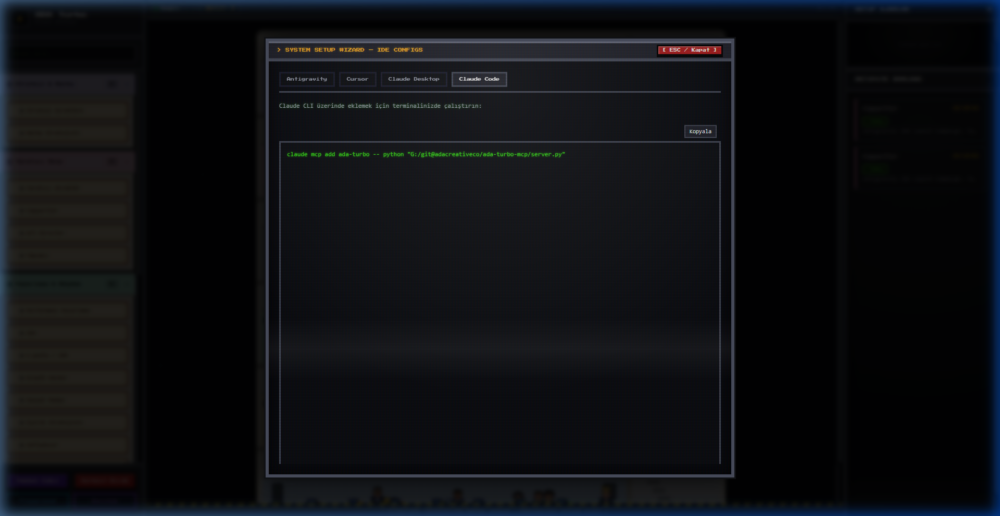

# ADA Turbo — Ajans İşletim Sistemi & Pixel Office

🇹🇷 Türkçe Dokümantasyon | 🇺🇸 [English Documentation](README.md)

ADA Turbo, ADA Creative Co. ajans işletim sistemini **MCP (Model Context Protocol)** ve etkileşimli **Pixel Office Görselleştiricisi** üzerinden sunan ticari kalitede bir altyapıdır.
Strateji, yaratıcı ekip, pazarlama, müşteri ilişkileri, analitik, ürün ve teknik olmak üzere 26 ajandan oluşan tam ajans yapısı, tüm MCP uyumlu istemcilerde ve canlı yapay zeka entegrasyonlu yerel web çalışma alanında anında kullanılabilir.

---

## 🚀 Öne Çıkan Özellikler

- **Birleşik Çift Modlu Mimari (Unified Dual-Mode):**
  - **MCP Modu (Varsayılan):** `server.py` doğrudan çalıştırıldığında stdio üzerinden MCP sunucusu olarak başlar ve arka planda Pixel Office web sunucusunu da otomatik çalıştırır. Antigravity, Claude Code, Cursor, Claude Desktop ve Windsurf gibi tüm istemcilerle tam uyumludur.
  - **Pixel Office Web Modu:** Retro CRT efektli yerel web arayüzünü başlatır (varsayılan port `8000`, meşgulse otomatik olarak `8001`, `8002`... portlarına geçer).
- **⚡ Server-Sent Events (SSE) ile Anlık Akış:**
  - `/api/events` üzerinden 0ms gecikmeli olay yayını. IDE'nizde bir ajanı çağırdığınız anda web arayüzündeki karakter gerçek zamanlı olarak masasına yürür!
- **🧠 Bağımsız Canlı LLM Entegrasyonu (Direct AI Engine):**
  - Web arayüzü üzerinden doğrudan `/api/llm-generate` ile canlı yapay zeka modellerini çalıştırma:
    - 🟢 **Dahili Şablon Motoru (Çevrimdışı):** İnternet veya API anahtarı olmadan profesyonel ajans iş akış şablonları.
    - ✨ **Google Gemini:** `gemini-2.0-flash`, `gemini-1.5-flash`, `gemini-1.5-pro`
    - 🧠 **OpenAI:** `gpt-4o-mini`, `gpt-4o`, `o3-mini`
    - ⚡ **Anthropic Claude:** `claude-3-5-sonnet-20241022`, `claude-3-5-haiku-20241022`
  - Güvenli yerel anahtar saklama (`localStorage`).
- **Geliştirici Araçları (Konsol Modalları):**
  - **Playground (Workflow & Canlı AI Test Aracı):** Komut ve görev bağlamı seçerek ister dahili şablonlarla ister canlı LLM ile daktilo efektli çıktı üretimi.
  - **AI Model Ayarları:** Sağlayıcı değiştirme, API anahtarı kaydetme ve hızlı model presetleri.
  - **Kurulum Sihirbazı (Setup Wizard):** Cursor, Antigravity, Claude Desktop ve Claude Code için otomatik oluşturulan kopyalamaya hazır JSON yapılandırmaları.
- **Piksel Karakter ve Animasyonlar:** 26 ajanın kendilerine ait nefes alma, göz kırpma ve yürüme animasyonları ofis katlarında gerçek zamanlı izlenebilir.
- **Tam Çift Dilli Destek (TR / EN):** Tüm arayüz butonları, durum rozetleri, modallar, ajan promptları ve referans dosyaları tek tıkla TR/EN arasında değişir.

---

## 🖥️ Pixel Office & Ekran Görüntüleri

#### 1. Pixel Office Dashboard


#### 2. CRT Workflow Playground


#### 3. CRT Kurulum Sihirbazı


---

## 🛠️ Kurulum ve Başlangıç

### 1. Bağımlılıkları Yükleyin
```bash
git clone https://github.com/adacreativeco/ada-turbo-ai-mcp.git
cd ada-turbo-mcp
pip install -r requirements.txt
```

### 2. Sunucuyu Başlatın
```bash
# Hem MCP stdio sunucusunu hem arka planda Pixel Office'i başlatır:
python server.py

# Ya da sadece web görselleştiriciyi başlatmak için:
python server.py --web
```
Tarayıcınızda [http://localhost:8000](http://localhost:8000) (veya otomatik seçilen portu) açın.

---

## 🔌 IDE Entegrasyonu (MCP)

#### **Antigravity**
`mcp_config.json` dosyanıza (Manage MCP Servers raw config) ekleyin:
```json
{
  "mcpServers": {
    "ada-turbo": {
      "command": "python",
      "args": ["/ABSOLUTE/PATH/ada-turbo-mcp/server.py"]
    }
  }
}
```

#### **Cursor**
`~/.cursor/mcp.json` veya proje kökündeki `.cursor/mcp.json` dosyasına ekleyin:
```json
{
  "mcpServers": {
    "ada-turbo": {
      "command": "python",
      "args": ["/ABSOLUTE/PATH/ada-turbo-mcp/server.py"]
    }
  }
}
```

#### **Claude Desktop**
`claude_desktop_config.json` dosyanıza ekleyin:
```json
{
  "mcpServers": {
    "ada-turbo": {
      "command": "python",
      "args": ["/ABSOLUTE/PATH/ada-turbo-mcp/server.py"]
    }
  }
}
```

#### **Claude Code (CLI)**
```bash
claude mcp add ada-turbo -- python "/ABSOLUTE/PATH/ada-turbo-mcp/server.py"
```

---

## 📂 Proje Mimarisi

```
ada-turbo-mcp/
├── server.py                   ← Birleşik çift modlu giriş noktası (MCP + Web)
├── index.html                  ← Retro CRT Pixel Office tek sayfa arayüzü
├── requirements.txt            ← Bağımlılıklar
├── pyproject.toml              ← Paket yapılandırması
├── references/                 ← İki dilli uzmanlık kural tabanı (.md)
│   ├── strategy-brand.md / strateji-marka.md
│   ├── creative-team.md / yaratici-ekip.md
│   ├── marketing-growth.md / pazarlama-buyume.md
│   ├── client-operations.md / musteri-operasyon.md
│   └── analytics-product-tech.md / analitik-urun-teknik.md
├── karakterler/                ← Piksel karakter görselleri ve generator scriptleri
├── animasyonlar/               ← Karakterlerin walk/idle sprite şeritleri
├── office-bina/ & office-zon/  ← Prosedürel piksel ofis binası üretim varlıkları
├── skill/                      ← Antigravity / Claude Code için paketlenmiş .skill dağıtımı
└── src/                        ← Python modülleri
    ├── mcp_server.py           ← FastMCP sunucu ve tool tanımları
    ├── web_server.py           ← Çok iş parçacıklı HTTP sunucusu, SSE ve LLM proxy
    └── workflow_manager.py     ← Komut yönlendirme, olay yayını ve çıktı şablonları
```

---

## 📄 Lisans

PolyForm Noncommercial License 1.0.0 kapsamında lisanslanmıştır. Detaylar için [LICENSE](LICENSE) dosyasına bakabilirsiniz.
