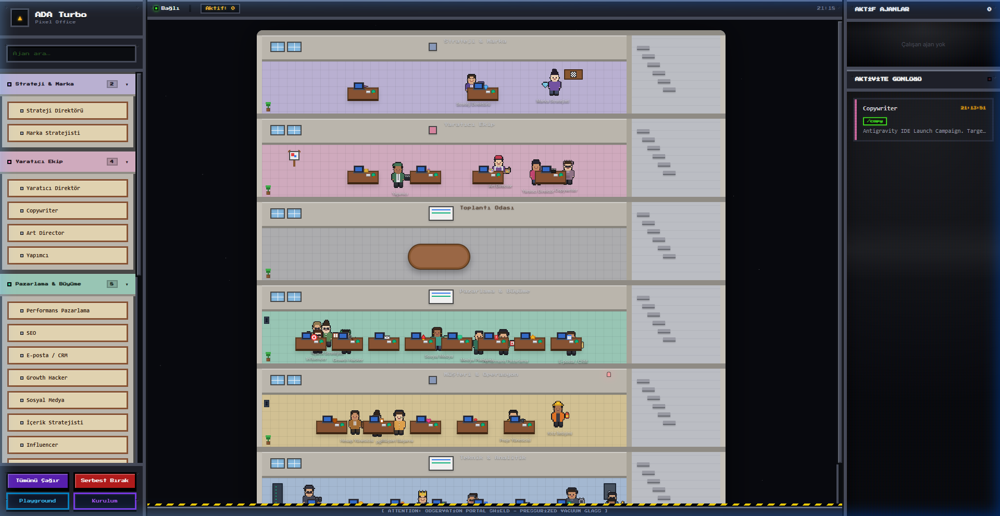
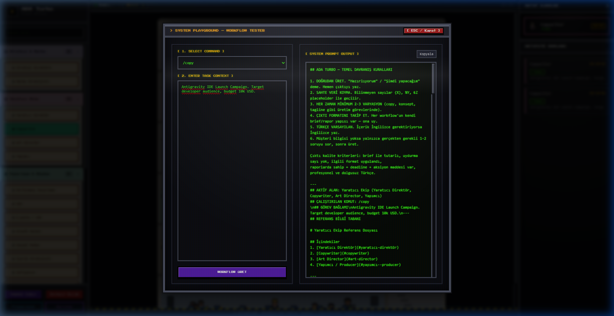

# ADA Turbo — Ajans İşletim Sistemi & Pixel Office

<div align="center">

[](https://modelcontextprotocol.io/)
[](https://pypi.org/project/ada-turbo-ai-mcp/)
[](https://python.org)
[](LICENSE)
[](https://smithery.ai)
[](https://github.com/adacreativeco/ada-turbo-ai-mcp/stargazers)
[](https://adacreative.co/vaka-analizleri/ada-turbo-mcp)

<br/>

**🇹🇷 Türkçe Dokümantasyon | 🇺🇸 [English Documentation](README.md)**

<p align="center">
  <strong>IDE ortamınızı tam teşekküllü bir yaratıcı ajansa dönüştürün.</strong><br/>
  ADA Turbo, <strong>ADA Creative Co.</strong> ajans işletim sistemini 26 uzman yapay zeka ajanıyla <strong>MCP (Model Context Protocol)</strong> üzerinden sunar ve bunu gerçek zamanlı retro CRT <strong>Pixel Office Görselleştiricisi</strong> ile birleştirir.
</p>

</div>

---

## 🎬 Canlı Piksel Ofis & Animasyon Önizlemesi

<div align="center">
  
</div>

<br/>

| 🏢 Pixel Office Görselleştirici | 🧪 CRT İş Akışı Playground |
| :---: | :---: |
|  |  |

---

## ⚡ Hızlı Başlangıç (10 Saniyede Çalıştırın)

### Seçenek A: `uvx` ile Kurulumsuz Çalıştırma (Önerilen)
Depoyu klonlamadan ve sanal ortam kurmadan doğrudan çalıştırabilirsiniz:

```bash
uvx ada-turbo-ai-mcp
```
*(Yalnızca web görselleştiricisini açmak için: `uvx ada-turbo-ai-mcp --web`)*

---

### Seçenek B: Standart Git / Python
```bash
# 1. Repoyu klonlayın
git clone https://github.com/adacreativeco/ada-turbo-ai-mcp.git
cd ada-turbo-ai-mcp

# 2. Bağımlılıkları yükleyin
pip install -r requirements.txt

# 3. Birleşik Çift Modu Başlatın (MCP stdio + Web Görselleştirici)
python server.py
```
Tarayıcınızda [http://localhost:8000](http://localhost:8000) adresini açın (port meşgulse otomatik `8001`, `8002`... portuna geçer).

---

## 🚀 Öne Çıkan Özellikler

- **Birleşik Çift Modlu Mimari (Unified Dual-Mode):**
  - **MCP Modu (Varsayılan):** `server.py` doğrudan çalıştırıldığında stdio üzerinden MCP sunucusu olarak başlar ve arka planda Pixel Office web sunucusunu da otomatik çalıştırır. Antigravity, Claude Code, Cursor, Claude Desktop ve Windsurf gibi tüm istemcilerle tam uyumludur.
  - **Pixel Office Web Modu:** Retro CRT efektli yerel web arayüzünü bağımsız başlatır (`python server.py --web`).
- **⚡ Server-Sent Events (SSE) ile Anlık Akış:**
  - `/api/events` üzerinden 0ms gecikmeli olay yayını. IDE'nizde bir ajanı çağırdığınız anda web arayüzündeki karakter gerçek zamanlı olarak masasına yürür!
- **🧠 Bağımsız Canlı LLM Entegrasyonu (Direct AI Engine):**
  - Web arayüzü üzerinden doğrudan `/api/llm-generate` ile canlı yapay zeka modellerini çalıştırma:
    - 🟢 **Dahili Şablon Motoru (Çevrimdışı):** İnternet veya API anahtarı olmadan profesyonel ajans iş akış şablonları.
    - ✨ **Google Gemini:** `gemini-2.0-flash`, `gemini-1.5-flash`, `gemini-1.5-pro`
    - 🧠 **OpenAI:** `gpt-4o-mini`, `gpt-4o`, `o3-mini`
    - ⚡ **Anthropic Claude:** `claude-3-5-sonnet-20241022`, `claude-3-5-haiku-20241022`
  - Güvenli yerel anahtar saklama (`localStorage`).
- **Geliştirici Araçları (CRT Konsol Modalları):**
  - **Playground (Workflow & Canlı AI Test Aracı):** Komut ve görev bağlamı seçerek ister dahili şablonlarla ister canlı LLM ile daktilo efektli çıktı üretimi.
  - **AI Model Ayarları:** Sağlayıcı değiştirme, API anahtarı kaydetme ve hızlı model presetleri.
  - **Kurulum Sihirbazı (Setup Wizard):** Cursor, Antigravity, Claude Desktop ve Claude Code için otomatik oluşturulan kopyalamaya hazır JSON yapılandırmaları.
- **Piksel Karakter ve Animasyonlar:** 26 ajanın kendilerine ait nefes alma, göz kırpma ve yürüme animasyonları ofis katlarında gerçek zamanlı izlenebilir.
- **Tam Çift Dilli Destek (TR / EN):** Tüm arayüz butonları, durum rozetleri, modallar, ajan promptları ve referans dosyaları tek tıkla dil değiştirir.

---

## 🔌 IDE Entegrasyonu (MCP)

### 1. Antigravity
`mcp_config.json` dosyanıza ekleyin:
```json
{
  "mcpServers": {
    "ada-turbo": {
      "command": "uvx",
      "args": ["ada-turbo-ai-mcp"]
    }
  }
}
```

### 2. Cursor
`~/.cursor/mcp.json` (genel) veya proje kökündeki `.cursor/mcp.json` içine ekleyin:
```json
{
  "mcpServers": {
    "ada-turbo": {
      "command": "uvx",
      "args": ["ada-turbo-ai-mcp"]
    }
  }
}
```

### 3. Claude Desktop
`claude_desktop_config.json` dosyanıza ekleyin:
```json
{
  "mcpServers": {
    "ada-turbo": {
      "command": "uvx",
      "args": ["ada-turbo-ai-mcp"]
    }
  }
}
```

### 4. Claude Code (CLI)
```bash
claude mcp add ada-turbo -- uvx ada-turbo-ai-mcp
```

*(Not: Yerel klon üzerinden çalıştırmak isterseniz `"command": "uvx"` ve `"args": ["ada-turbo-ai-mcp"]` yerine `"command": "python"` ve `"args": ["/MUTLAK/YOL/server.py"]` yazabilirsiniz.)*

---

## 👥 26 Ajans Rolü ve Departmanlar

ADA Turbo, 5 ana departmanda 26 uzman ajanı bir araya getirir:

1. **Strateji ve Marka:** Marka Direktörü, Marka Stratejisti, Tüketici İçgörü Lideri, İsimlendirme Uzmanı, Yaratıcı Teknolog.
2. **Yaratıcı Ekip & Tasarım:** Yaratıcı Yönetmen (CD), Kıdemli Metin Yazarı, Sanat Yönetmeni (AD), UX/UI Tasarım Lideri, 3D / Motion Tasarımcısı.
3. **Pazarlama & Büyüme:** Büyüme Pazarlaması Direktörü, Performans Pazarlama Uzmanı, SEO & İçerik Stratejisti, Sosyal Medya Lideri, CRM & Sadakat Yöneticisi.
4. **Müşteri İlişkileri & Operasyon:** Müşteri İlişkileri Direktörü, Kıdemli Müşteri Yöneticisi, Ajans Prodüktörü, Operasyon Direktörü, Trafik Yöneticisi.
5. **Analitik, Ürün & Teknoloji:** Veri & Analitik Lideri (CDO), Pazarlama Veri Analisti, Full-Stack Geliştirme Lideri, Yapay Zeka Çözüm Mimarı, QA & Dağıtım Lideri.

---

## 📂 Mimari

```
ada-turbo-mcp/
├── server.py                   ← Birleşik çift modlu giriş noktası (MCP + Web)
├── index.html                  ← Retro CRT Pixel Office tek sayfa arayüzü
├── pyproject.toml              ← Paket ayarları ve komut satırı bağlantıları
├── smithery.yaml               ← Smithery.ai tek tıkla kurulum yapılandırması
├── requirements.txt            ← Proje bağımlılıkları
├── references/                 ← Çift dilli alan bilgi bankaları (.md)
│   ├── strategy-brand.md / strateji-marka.md
│   ├── creative-team.md / yaratici-ekip.md
│   ├── marketing-growth.md / pazarlama-buyume.md
│   ├── client-operations.md / musteri-operasyon.md
│   └── analytics-product-tech.md / analitik-urun-teknik.md
├── karakterler/                ← Piksel karakter görselleri ve üretim scriptleri
├── animasyonlar/               ← Karakter yürüme/bekleme spritesheetleri ve GIF önizlemeleri
├── office-bina/ & office-zon/  ← Prosedürel piksel ofis mimari bileşenleri
├── skill/                      ← Paketlenmiş .skill dağıtım paketi
└── src/                        ← Python modülleri
    ├── mcp_server.py           ← FastMCP sunucu tanımları ve araç kayıtları
    ├── web_server.py           ← Çok iş parçacıklı HTTP sunucusu, SSE yayını & LLM proxy
    └── workflow_manager.py     ← Komut yönlendirme, olay dinleyicisi & şablonlar
```

---

## 📄 Lisans

PolyForm Noncommercial License 1.0.0 kapsamında dağıtılmaktadır. Detaylar için [LICENSE](LICENSE) dosyasına bakabilirsiniz.

**[ADA Creative Co.](https://github.com/adacreativeco)** tarafından ❤️ ile geliştirilmiştir.
